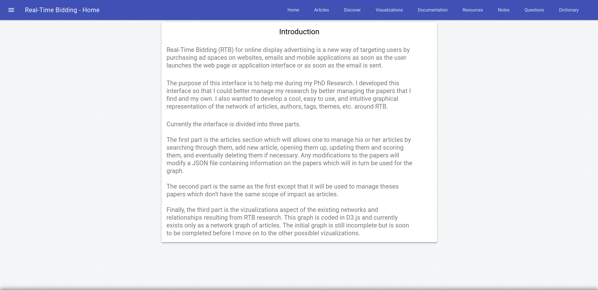
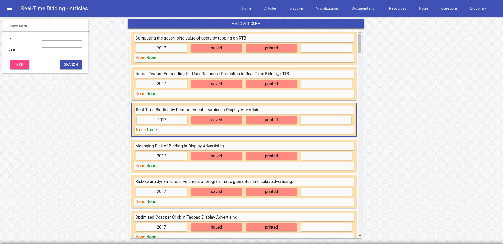
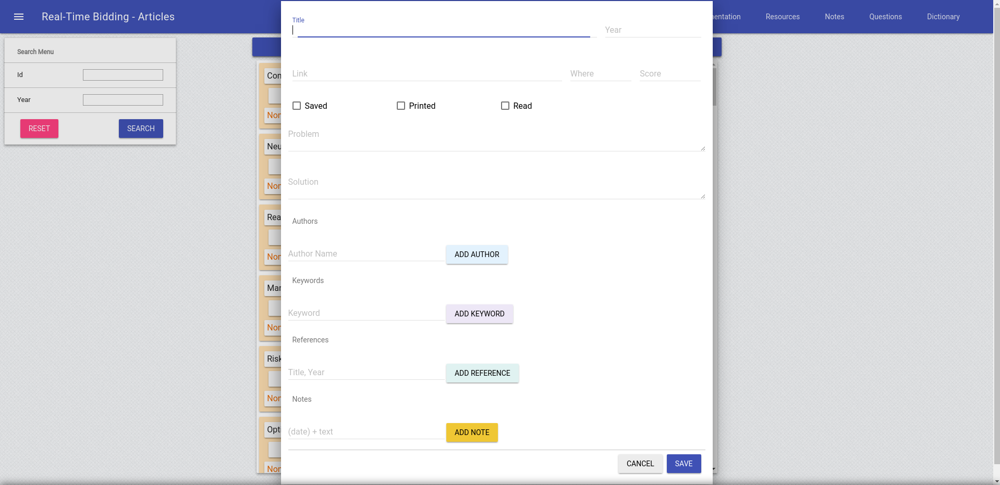
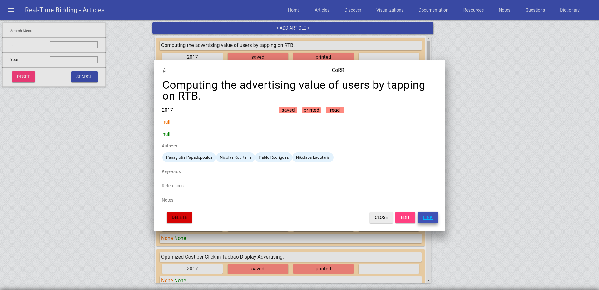
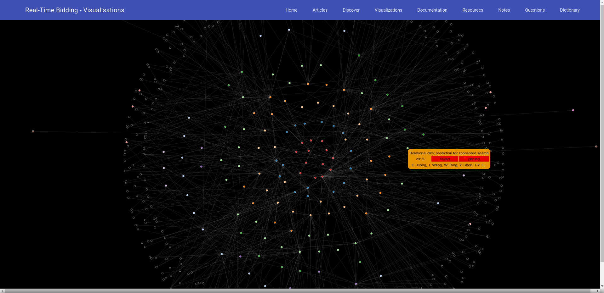
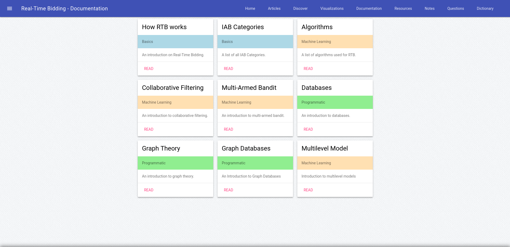
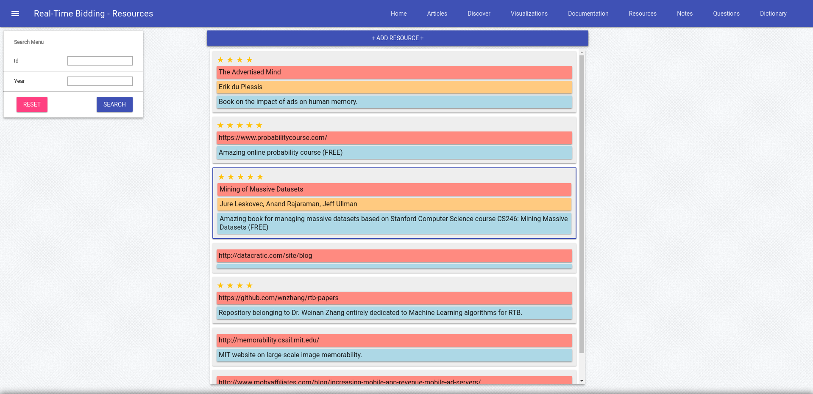
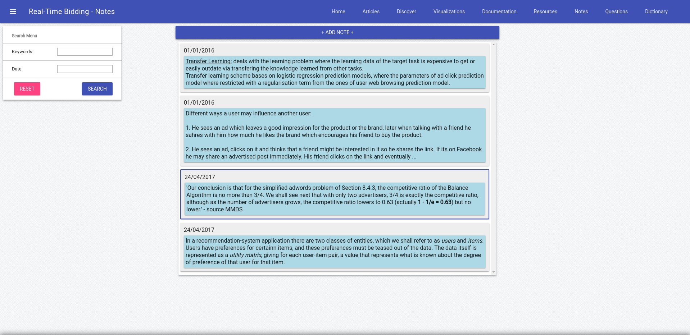
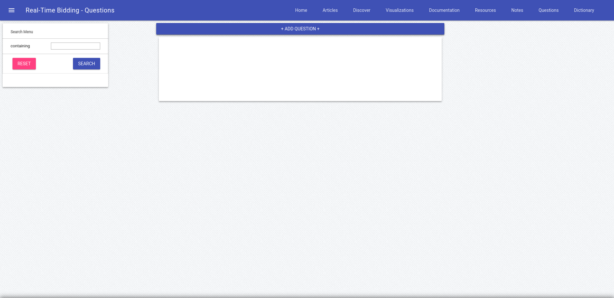

# Research Web Interface

The Research Web Interface (RWI) is a Flask web interface designed specifically to answer my needs
regarding research.

The interface is organised in several sections:

- Home
- Articles
- Discover
- Visualizations
- Documentation
- Resources
- Ideas / Notes
- Questions
- Dictionary

Although I have designed and coded this interface to answer my own personal needs, I hope that it may be used
by any other researcher who might find it useful and who might enjoy contributing to it.

There exist many available software for organising scientific papers but none I have found offer
a nice display, easy-to-use functionalities and great visualizations. I do not claim to achieve perfection
but I am hoping that an interested community might participate in this open-source project to facilitate the work of the
scientific community.

## Home

The basic introductory page for both the interface and the research subject itself.
In my case: Real-Time Bidding.

## Articles

This is where one should be able to find a complete list of all the relevant articles that he or she has found online.

- The user should be able to search articles by id, year, keywords, authors, saved, printed or read and more
- The user should be able to manually add an article
- The user should be able to easily view the most important information for each article:
  - Title, year, saved, printed, score and a summary
- The user should be able to click on a card to view more details about the article:
  - Id, score, title, year, saved, printed, read, problem, solution, authors, keywords and references
  - If a url is provided, the user may open the article in another tab
- The user should be able to Edit any desired article and even delete an article

## Visualizations

This is where one should be able to visualize all the most interesting aspects of his or her articles and
the relationships that the articles have amongst themselves.

- The user should be able to view a graph of articles connected by references
  - Upon clicking a node, the user should view it's neighbors
  - A user should be able to view clusters of articles by keywords
  - ...
- The user should be able to view a histogram of articles by year, keywords, authors, etc.
  - More filters should be able to be applied (if useful)
- The user should be able to view a tree diagram of the ancestry of an article

It would be interesting to connect these visualizations with the Articles page in order to allow the user to click a node and view it's details.

## Documentation

This is where one should be able to find all blog type articles written to further explain the research theme.

- Articles are colored by type and can be filtered by type

For RTB there are different types of docs:

- Basic
- Business
- Programmatic
- Mathematics
- Machine Learning

These articles should be written in Markdown and converted to HTML format for proper display on the webpage.

## Resources

This is where one should be able to find a list of resources concercing the research theme.

There are different types of resources:

- Blog
- Book
- Online Article
- News Article

## Ideas / Notes

Currently defined as Ideas, this section might be changed to Notes to allow the user
to properly gather and organise his or her thoughts regarding his research.

I find myself sometimes taking notes but forgeting about them. This would allow me to
aggregate the necessary information all in one clean page.

## Questions

There are many questions that can be asked about specific domains. It is important to take note of the question and of it's answer if available. Often an unanswered question can be the source of further investigation, research and eventually innovation. Having available a list of all questions and answers will prove useful when things get more complex.

## Dictionary

There are many important, complex and specific terms to every research domain. I find it's important to have a list of terms and definitions available.

## Further Work

Everything here is subjet to change but there are additional features that I would be interested in implementing.

- A webscraper for automatic article extraction based on keywords
- An article "id" generator to use with references between articles
- An article reference manager to easily associate articles amongst themselves through their ids without having to manually do so.
- Allow user to access his or her account via a login and password to provide security of information and multiple accounts
- Maybe make it all responsive for accessing via a smartphone or tablet...
